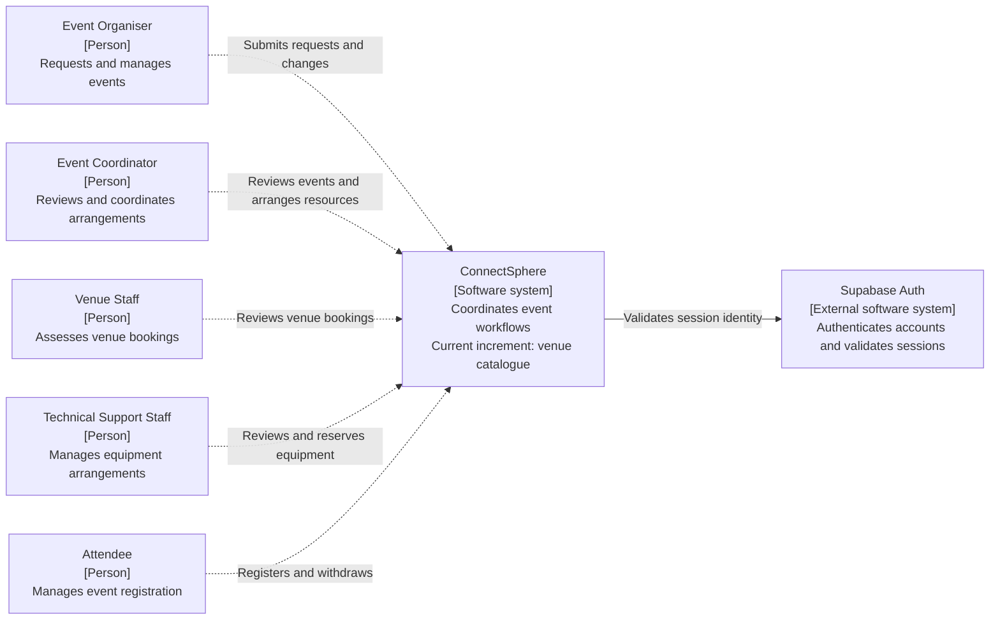
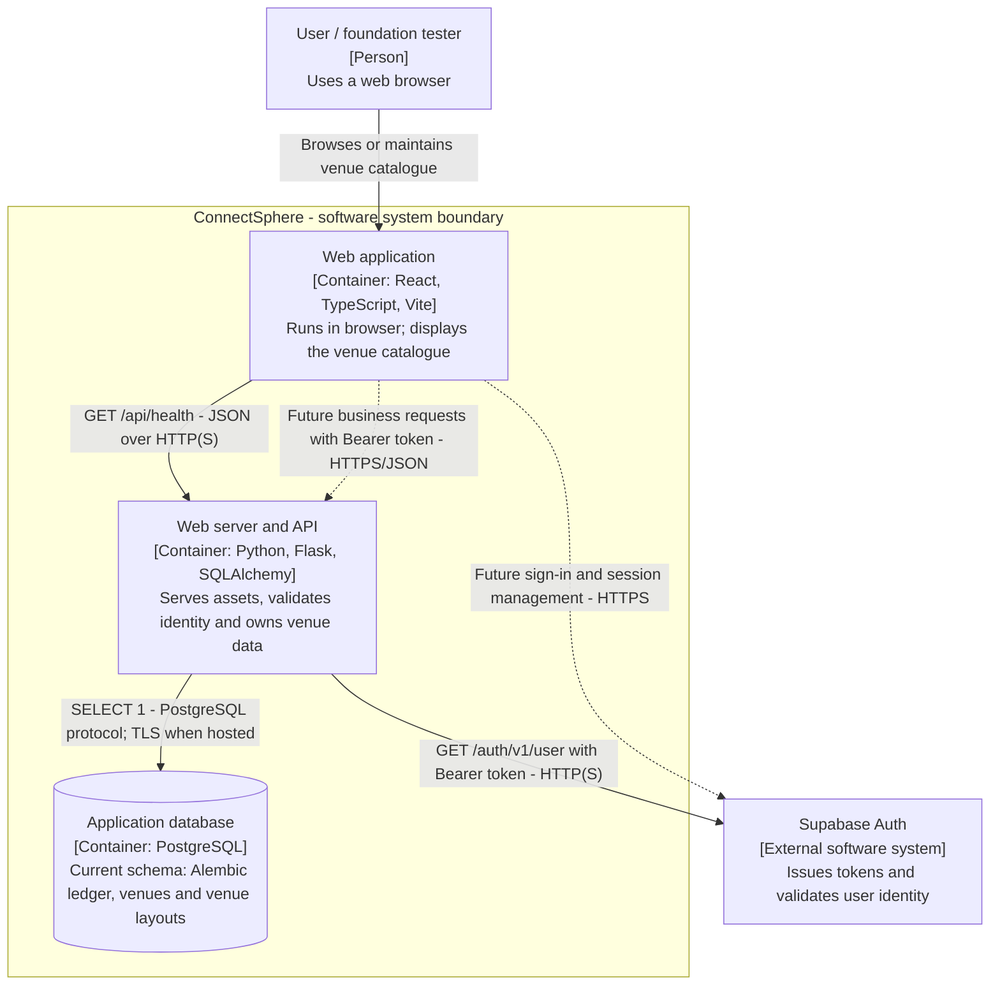
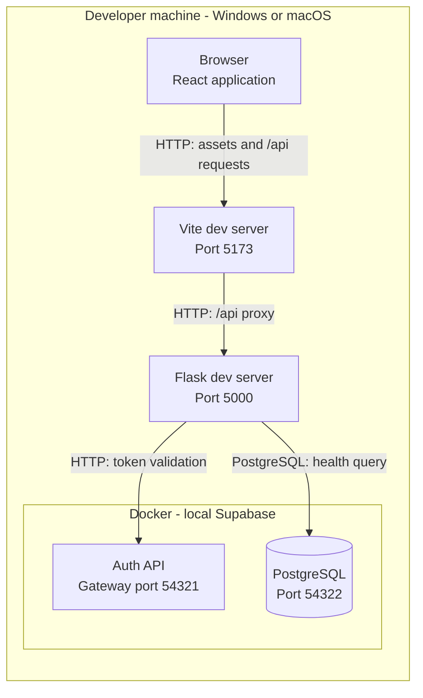
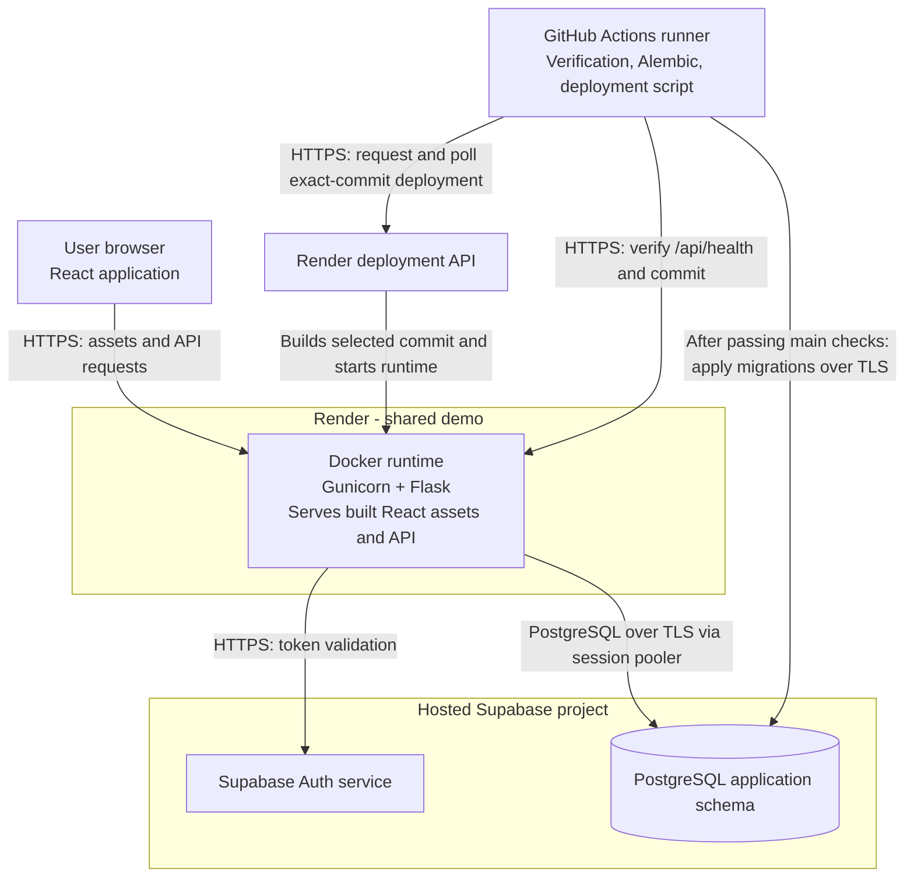

# ConnectSphere C4 model

Status: foundation design, 8 September 2026. Product workflows are not implemented.
This model evolves with reviewed code; it is not a claim that the release is complete.

## Assignment and notation

Week 4 Project Instructions, page 5, deliverable 2 requires system design conveyed using C4.
Pages 5-6 require coherent workflows and traceable tests; page 8 evaluates responsibilities,
design decisions and trade-offs. The PDF does not specify mandatory C4 levels. Obtain the
original instructions from eLearn; the restricted course PDF is not copied into this repository.
Page 7 says only the team's own section's clarifications apply.

These views use Mermaid flowcharts with C4 element types, responsibilities, boundaries and
labelled relationships. Read the rendered Markdown on GitHub. A C4 container means an application
or data store, not necessarily a Docker container. See the official
[context](https://c4model.com/diagrams/system-context) and
[container](https://c4model.com/diagrams/container) guidance.

Key: solid arrows describe implemented infrastructure; dotted arrows describe future product
interactions. Boxes identify their C4 type. Deployment boundaries describe hosting, not ownership.

## Level 1: system context

Scope: ConnectSphere as a whole. Audience: the team and customer.
The five user roles below come from Week 4 pages 2-4; their business actions are future scope.
Supabase Auth is an external software dependency, even when operated locally for development.

The requirements summary also records Operations Manager assignment from a customer clarification.
Its section applicability and relationship to these actors must be confirmed when the team reconciles
the full baseline. It is not silently assigned to one of the five roles here. Notification delivery
channels and integrations remain undecided, so no email provider or worker is invented in this model.

## Level 2: containers

Scope: applications and data store that make up ConnectSphere. Audience: developers.
PostgreSQL application storage belongs inside our logical system boundary even though Supabase
hosts it. Supabase owns its Auth implementation and Auth schema; Alembic owns our application schema.

The current React application can use an existing Supabase Auth session to open the venue catalogue;
sign-in and trusted account-role records are delivered independently. The real-authentication smoke
test obtains a token from Auth and calls `/api/session` directly. Browser business records must go
through Flask, never directly to the Supabase Data API. The venue catalogue uses a temporary
default-deny resolver seam until the shared role story supplies trusted roles.

## Deployment views: local and shared demo

Scope: where the containers run. These supplement C4 levels 1 and 2.

Each teammate owns their local clone, configuration and database. `npm run setup` installs
dependencies and prepares local services; `npm start` launches Vite and Flask. A supported
Docker backend is required; a WSL shell and Make are optional. Local Auth's internal persistence
is omitted from these application-focused views.

React runs in the browser, although its static files are packaged in the same Docker image as
Flask. CI builds an image for verification; Render rebuilds the selected commit rather than
promoting that immutable image. Migrations precede deployment, so a failed deployment may leave
the new schema applied. See the [deployment and recovery guidance](../infrastructure/deployment.md).

## Trace the model into the repository

| Responsibility | Implementation / configuration | Evidence |
| --- | --- | --- |
| Browser shell and health request | [App.tsx](../../frontend/src/App.tsx) | [Frontend tests](../../frontend/src/App.test.tsx) |
| API, static serving and token validation | [Flask factory](../../backend/app/__init__.py) | [API tests](../../backend/tests/test_foundation.py) |
| Application schema and revision history | [Models](../../backend/app/models.py), [migrations](../../backend/migrations/env.py) | [PostgreSQL gate](../../backend/tests/test_postgres.py) |
| Local environment and proxy | [dev.py](../../scripts/dev.py), [Vite](../../frontend/vite.config.ts), [Supabase](../../supabase/config.toml) | [Setup regression tests](../../scripts/tests/test_dev.py), [browser/Auth smoke](../../e2e/foundation.spec.ts) |
| Production packaging and delivery | [Dockerfile](../../Dockerfile), [CI](../../.github/workflows/ci.yml), [deploy.py](../../scripts/deploy.py) | [Recorded verification](../infrastructure/verification.md) |

## Existing decisions and trade-offs

| Choice | Reason and consequence |
| --- | --- |
| One repository and one Flask deployment | Keeps local startup and shared delivery small; frontend/backend releases are coupled. |
| Supabase Auth with server-side token validation | Reuses identity infrastructure; protected requests depend on Auth availability and add a network call. Business permissions remain our responsibility. |
| Business data through Flask | Provides one place for validation, permissions and transactions; future tables need explicit browser-access denial tests. |
| PostgreSQL and Alembic | Supports transactional booking/reservation work and versioned schema evolution; conflict rules still need design and concurrency tests. |
| Native commands with local Supabase | Gives each developer an isolated environment; Docker compatibility and downloads are onboarding prerequisites. |
| Free shared hosting | Fits the current budget; availability and recovery must be considered before demonstrations. |

These explain the foundation already selected, not new team-approved business decisions.
Level 3 component views should be added as meaningful business modules emerge. There is currently
one small Flask factory; labelling future event/booking/notification services as implemented
components would misrepresent the code. Level 4 code diagrams are deferred until useful.

## Keeping the design current and submitting it

For a PR that changes a boundary, dependency, responsibility or hosting arrangement, update the
affected view and its code/test links in that PR. Convert future relationships to implemented
ones only when supported by code and verification. Record significant new trade-offs alongside them.

Before submission, reconcile the model with the final release and the team's own section's
clarifications. Export the rendered diagrams and explanations to readable document(s) for
deliverable folder 2; raw Mermaid alone is not the finished submission document. Check exported
labels and arrows for readability. This Markdown is the version-controlled source and is included
by the repository's existing source packaging rules.
